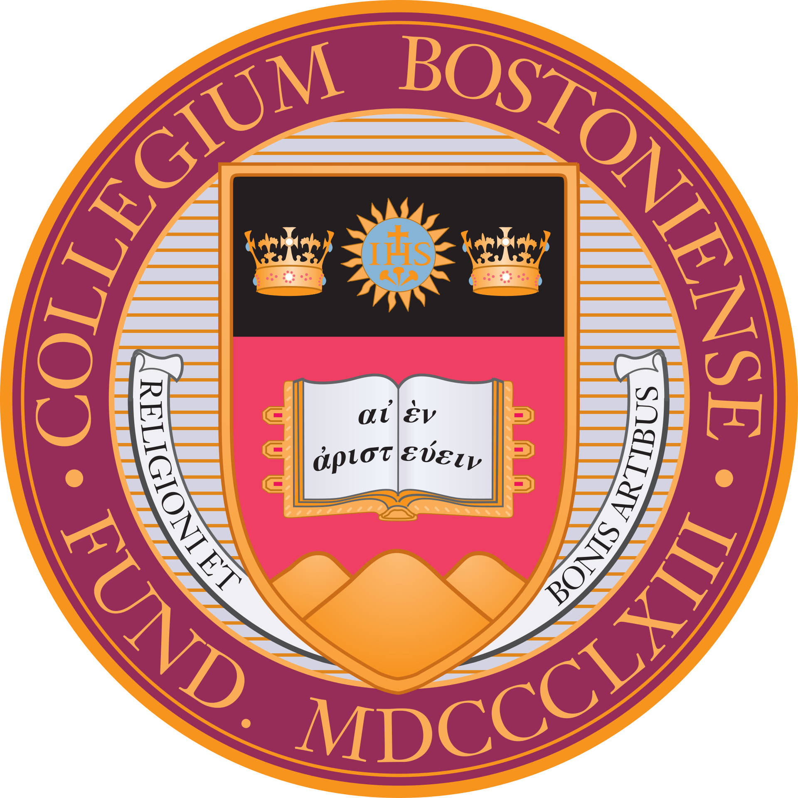
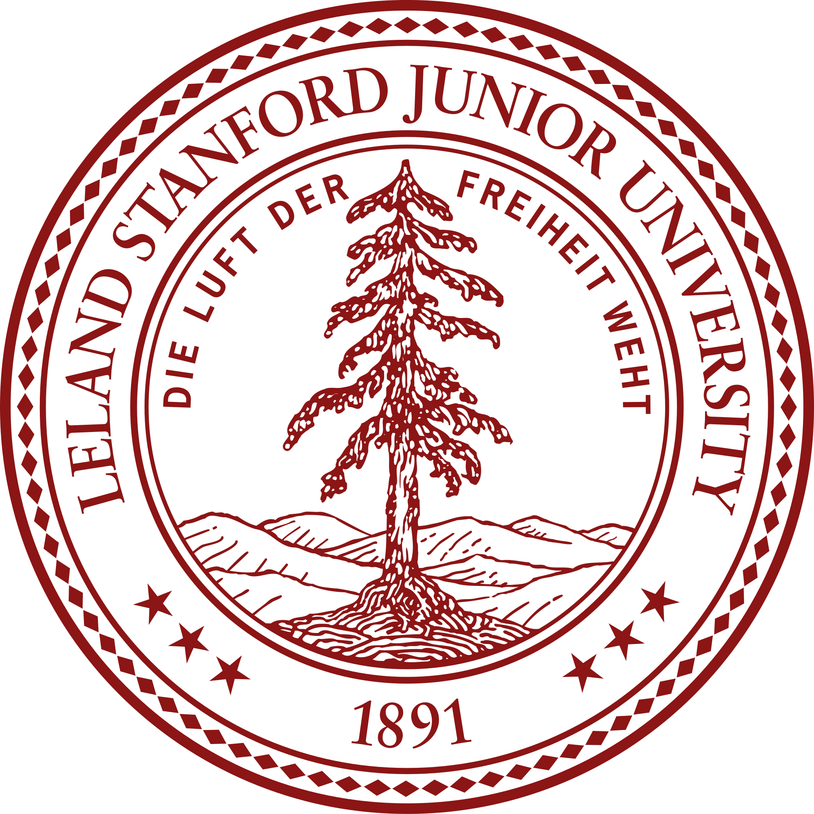

<h1 align="center"> Hey there! I'm Noah 👋 </h1>

### Quick Intro 

I'm a data scientist at Whatnot specializing in econometrics, pricing, structural modeling, and causal inference. I'm eagerly honing my skills in data engineering and software engineering to better understand every and anything data.  

 
  <a href="https://www.whatnot.com/">
    

In my freetime I'm always working on some side project, or making my way through a textbook.

### Skills 

#### Tools of the Trade
  

 
  <a href="https://www.python.org/">
    
  <a href="https://www.r-project.org/">
    
  <a href="https://julialang.org/">
    
    
  <a href="https://www.mathworks.com/products/matlab.html">
    
  <a href="https://aws.amazon.com/">
    
  <a href="https://www.snowflake.com/en/">
    
  <a href="https://www.getdbt.com/">
    
  <a href="https://www.wolfram.com/mathematica/">
    
   <a href="https://www.stata.com/">
    
  <a href="https://www.latex-project.org/">
    
  <a href="https://jupyter.org/">
    
  <a href="https://quarto.org/">
    
  <a href="https://hex.tech/">
    
  <a href="https://pandas.pydata.org/">
    
  <a href="https://scikit-learn.org/stable/">
    
  <a href="https://www.tidyverse.org/">
    
  <a href="https://code.visualstudio.com/">
    
    

#### Economics

- Game Theory
- Mechanism Design
- Expected Utility Theory and Decision Making Under Uncertainty
- Auction Theory
- Industrial Organization
- Matching Theory

#### Statistics/Econometrics   
    
- Theoretical Statistics
- Linear Models
- Nonlinear Models
- Information Theory
- Machine Learning
- Causal Inference
- Bayesian Methods
- Nonparametrics and Semiparametrics

#### Mathematics (Pure and Applied)
    
- Linear Algebra 
- Abstract Algebra (Groups, Rings, Fields, Galois Theory)
- Point Set Topology
- Real Analysis (Advanced Calculus)
- Measure Theory
- Functional Analysis
- Probability Theory
- Numerical Analysis
- ODEs and PDEs
- Theory of Optimization
- Linear/Nonlinear Programming
- Convex Optimization
- Dynamic Programming and Optimal Control

#### What I'm Currently Learning
    
- C++
- Variational Analysis
    
    
### Projects

### Background

Before working as a data scientist, I intended to pursue my PhD in economics. While an undergraduate at Boston College I completed the two years of doctoral coursework in economics with specializations in micreconomic theory and econometric theory. I also completed the math departments honors track, which included taking a PhD-level real analysis course. As an undergad I was a [McNair Scholar](https://mcnairscholars.com/) and had the pleasure to be mentored by [Dr. Tayfun Sönmez](https://www.tayfunsonmez.net/) After graduating from Boston College with my BS in economics and mathematics (departmental honors in both subjects) I was a predoctoral research fellow at Stanford, where I got to put my theoretical knowledge of econometrics to work while RAing for faculty specializing in industrial organization. In 2021 I was awarded the National Science Foundation's Graduate Research Fellowship to earn my doctorate in economics, but declined the award to pursue learning oppurtunities in "industry" (as the cool kids call it).
    
Broadly speaking my research interests fell under the umbrella of market design and mechanism design. I was particularly interested in the intersection of mechanism design and behavorial economics and developing ways for economists to model non-rational behavior when engineering markets. I also

 
  
  
  

<!--
**noahjussila/noahjussila** is a ✨ _special_ ✨ repository because its `README.md` (this file) appears on your GitHub profile.

Here are some ideas to get you started:

- 🔭 I’m currently working on ...
- 🌱 I’m currently learning ...
- 👯 I’m looking to collaborate on ...
- 🤔 I’m looking for help with ...
- 💬 Ask me about ...
- 📫 How to reach me: ...
- 😄 Pronouns: ...
- ⚡ Fun fact: ...
-->
